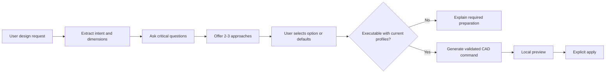

# AI Planning Mode

CadPilot separates broad design reasoning from geometry mutation. A signed-in user first asks for a design plan. The planner extracts intent, identifies only critical missing inputs, proposes two or three build approaches, and returns an ordered set of stages. No geometry changes during planning.

## Flow

`POST /v1/ai/plans` accepts the same bounded prompt and project context as command generation. It returns a validated versioned plan containing extracted design information, missing inputs, selectable options, assumptions, preparation, and staged work.

`POST /v1/ai/plans/command` accepts the original prompt, validated plan, selected option, answers, and current project context. The server rejects altered or invalid plans, unknown options, and plans whose prerequisites are not available. Successful provider output still passes the existing server validator, Flutter validator, non-mutating preview, and explicit Apply action.

Groq planning uses encrypted keys configured through the admin dashboard. If a provider is unavailable or returns an invalid plan, CadPilot returns a safe local planning fallback so broad requests remain useful. Provider failures never bypass geometry validation.

## Current execution boundary

Planning supports broad objects such as tables and desks. Automatic geometry execution remains limited to operations already supported by the deterministic model engine: extrude, cut, full revolve, shell, fillet, chamfer, rename, and delete. Plans requiring new closed sketch profiles explain that preparation and keep CAD generation disabled until suitable profiles exist.
