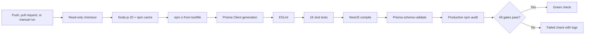

# Backend continuous integration

CadPilot's backend quality and security gates run automatically in GitHub Actions through `.github/workflows/backend-ci.yml`. The workflow protects the reproducibility of the NestJS service independently of any developer machine.

## Trigger and permissions model

The workflow runs on:

- every push to `main`;
- every pull request targeting `main`;
- manual dispatch from the GitHub Actions interface.

Its `GITHUB_TOKEN` receives only `contents: read`. The job does not deploy, mutate repository contents, access production infrastructure, or require application secrets. Concurrent runs for the same branch or pull request cancel older runs so stale commits do not consume runner time.

## Pipeline



The steps execute sequentially and fail fast. A green result means the exact locked dependency graph installed, Prisma Client generated, lint passed, all backend tests passed, TypeScript compiled, the Prisma schema parsed successfully, and npm reported no known production dependency vulnerabilities at execution time.

## Database and secret isolation

`prisma validate` requires a syntactically valid `DATABASE_URL`, but it does not connect to PostgreSQL. CI supplies a non-secret localhost placeholder solely for schema validation. No database service is started, and no production URL, JWT secret, OpenAI key, or Vercel credential is used.

The unit and HTTP compatibility suites override `PrismaService` where required. They exercise validation, guards, request-size enforcement, CAD command generation logic, and service behavior without external network calls.

## Runtime and dependency policy

The workflow uses Node.js 20, matching `server/package.json` and the backend Docker image. `npm ci` is mandatory instead of `npm install`, so CI fails if `package.json` and `package-lock.json` disagree. An explicit `prisma generate` step then produces the typed client instead of relying on package-manager lifecycle-script behavior. npm caching is keyed from `server/package-lock.json`; the cache accelerates downloads without replacing the clean lockfile install.

The workflow pins official `actions/checkout` v6.0.2 and `actions/setup-node` v6.4.0 to their immutable release commits. Review and re-resolve action upgrades and Node runtime changes before merging them.

## Local equivalent

Run this sequence from `server/` before pushing:

```powershell
npm ci
npx prisma generate
npm run lint
npm test
npm run build
npx prisma validate
npm audit --omit=dev
```

A local pass is strong pre-push evidence, while the GitHub-hosted result remains authoritative for repository checks because it runs in a clean Ubuntu environment.

## Branch protection recommendation

In GitHub repository settings, add a branch protection rule for `main` and require the check named **Lint, test, build, validate, audit** before merging. Also require pull requests and prevent force pushes. This is a repository-owner setting and is intentionally not changed by the workflow itself.

## Future expansion

The next CI layers should be introduced as separately observable jobs:

1. PostgreSQL-backed integration tests using an ephemeral service container.
2. Endpoint-level rate-limit and abuse tests.
3. Dependency review and software-bill-of-materials generation.
4. Signed backend deployment workflows with protected environments.

Keeping these as distinct jobs will expose which platform failed and allow safe parallel execution without weakening the backend gate.
