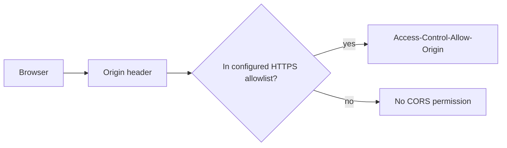

# Backend CORS allowlist

CadPilot enables browser CORS only when production runtime configuration provides an
explicit `CORS_ALLOWED_ORIGINS` allowlist. This prevents arbitrary websites from reading
API responses in a browser while preserving native/tablet clients, which do not use the
browser CORS model.



## Configuration

Set the variable only in the API deployment environment:

```dotenv
NODE_ENV=production
CORS_ALLOWED_ORIGINS=https://cadpilot.vercel.app,https://staging.example.com
```

Each entry must be an HTTPS origin with no path, query, fragment, wildcard, or trailing
slash. Production startup fails before opening the HTTP port when the allowlist is empty
or malformed. The current public CadPilot web app origin is `https://cadpilot.vercel.app`.

CORS is not authentication and does not replace bearer-token validation, request limits,
or TLS. It is a browser-enforced response-sharing policy. The configuration uses
`credentials: false`; CadPilot’s API authenticates requests with explicit bearer tokens,
not browser cookies.

## Verification

- `runtime-config.spec.ts` verifies valid HTTPS lists and rejects empty, HTTP, path-based,
  and malformed production values.
- `cors.integration.spec.ts` runs a real Nest HTTP app and verifies that only the allowed
  origin receives `Access-Control-Allow-Origin`.