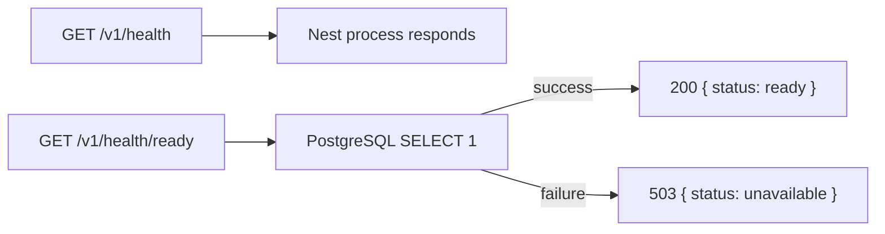

# Backend health checks

CadPilot separates process liveness from database readiness so deployment platforms can
restart a dead server without treating a running but disconnected API as healthy.

| Route | Meaning | Successful response |
| --- | --- | --- |
| `GET /v1/health` | The HTTP process is live. It does not require PostgreSQL. | `200 { "status": "ok", "phase": 1 }` |
| `GET /v1/health/ready` | The API can reach PostgreSQL and should receive traffic. | `200 { "status": "ready" }` |

The readiness query is a constant `SELECT 1`. It does not read project data, does not
log connection errors, and returns only `503 { "status": "unavailable" }` on a database
failure. Configure a load balancer or orchestrator to use liveness for process restart
and readiness to remove an unhealthy instance from traffic.

## Verification

Unit tests cover successful and failed database probes. An HTTP compatibility test runs
the readiness endpoint through the real Nest/Express stack with a mocked Prisma query.
The PostgreSQL integration job exercises the service against a real disposable database.