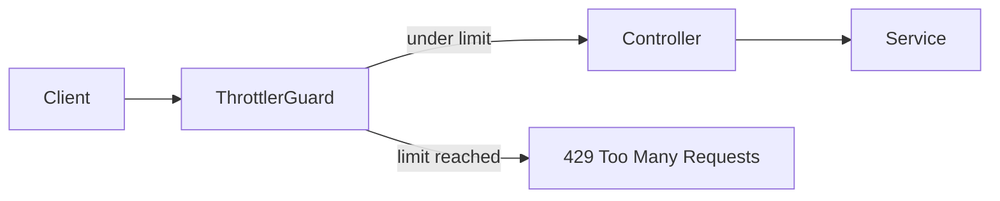

# Backend rate limiting

CadPilot applies targeted, IP-based rate limits to its most abuse-prone API surfaces.
The health endpoint and ordinary project API calls are deliberately not covered by this
increment, so operational checks and normal authenticated use are unaffected.

| Route group | Window | Maximum | Purpose |
| --- | ---: | ---: | --- |
| `/v1/auth/*` | 60 seconds | 5 requests per IP | Limits credential stuffing and repeated registration attempts. |
| `/v1/ai/commands` | 60 seconds | 10 requests per IP | Limits costly AI command generation requests. |

The limiter uses Nest's built-in in-memory storage. This is suitable for the current
single-instance deployment, but it is not shared between multiple server instances.
Before horizontally scaling the API, replace it with a shared storage implementation
(for example, Redis) so all instances enforce one common limit.

## Proxy deployment

The default tracker uses the request IP address. If the API is deployed behind a reverse
proxy, configure Express to trust only the known proxy hops before relying on forwarded
client IP addresses. Do not blindly trust all `X-Forwarded-For` headers: a directly
connected client could otherwise select its own identity and evade the limit.

## Verification

`src/rate-limit.integration.spec.ts` starts a real Nest HTTP application and sends six
invalid registration requests from one client. The first five reach DTO validation and
return `400`; the sixth is rejected by the guard with `429`. The test avoids creating
users or calling external services.

## References

- [NestJS rate-limiting guide](https://docs.nestjs.com/security/rate-limiting)
- [@nestjs/throttler package](https://www.npmjs.com/package/@nestjs/throttler)