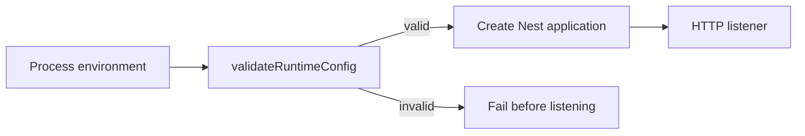

# Backend runtime configuration

CadPilot validates configuration at process startup before opening its HTTP port. The
checks are deliberately strict only in `NODE_ENV=production`, keeping local development,
unit tests, and disposable CI databases simple while preventing obvious production
misconfiguration.

| Value | Validation | Production behavior |
| --- | --- | --- |
| `PORT` | Integer 1–65535 | Required to be valid in every environment; defaults to `3000`. |
| `JWT_ACCESS_SECRET` | Unique, non-placeholder, at least 32 characters | Required. |
| `JWT_REFRESH_SECRET` | Unique, non-placeholder, at least 32 characters | Required and must differ from access secret. |
| `NODE_ENV` | `production` enables secret checks | Keep `development` for local work. |

## Deployment checklist

1. Generate two independent secrets using a cryptographically secure secret manager.
2. Set `NODE_ENV=production` in the API environment.
3. Set `JWT_ACCESS_SECRET` and `JWT_REFRESH_SECRET` only in the server deployment,
   never in Flutter or Vercel client variables.
4. Restart the process and verify it reaches `/v1/health`.

The validation does not log environment values or secrets. A rejection reports only the
configuration key and rule that needs attention.

## Verification

`src/runtime-config.spec.ts` covers development defaults, valid production configuration,
placeholder/short secret rejection, duplicate-secret rejection, and invalid port values.