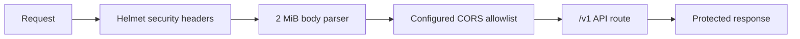

# Backend security headers

CadPilot's Nest/Express API applies Helmet before body parsing, CORS, and route setup.
This gives every API response a baseline set of defensive HTTP headers without changing
its JSON contract or bearer-token authentication model.

## Applied policy

Helmet provides standard headers including a Content Security Policy, `X-Content-Type-
Options: nosniff`, frame protection, referrer policy, removal of `X-Powered-By`, and
HSTS in production. The API is JSON-only, so Helmet's default CSP does not need the
asset exceptions required by a rendered web application.

In production, HSTS and CSP's `upgrade-insecure-requests` remain enabled. In local
development they are disabled to avoid a browser permanently upgrading `localhost` HTTP
to HTTPS, while the other defensive headers remain active.

## Verification

`security-headers.integration.spec.ts` starts a real Nest HTTP server in production mode
and checks CSP, HSTS, MIME-sniffing protection, frame protection, and removal of the
Express fingerprint header.

## References

- [NestJS Helmet guide](https://docs.nestjs.com/security/helmet)
- [Helmet package reference](https://www.npmjs.com/package/helmet)