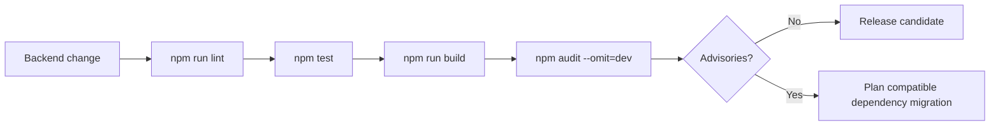
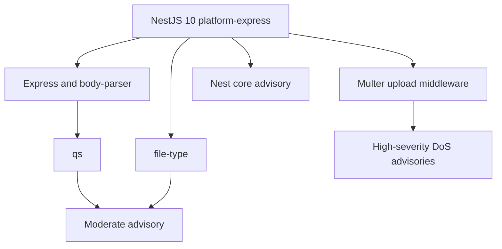

# Backend TypeScript lint gate

## Outcome

The CadPilot NestJS backend now has a functioning TypeScript ESLint gate.

> **Follow-up completed:** The advisories recorded in this checkpoint were resolved by the tested [NestJS 11 security migration](nestjs-11-security-migration.md), which produced a zero-vulnerability production audit.

The previously present `npm run lint` script could not execute because no ESLint configuration, TypeScript parser, or TypeScript rules plugin existed. This increment installs matching parser/plugin versions, adds a server-root configuration, and verifies every TypeScript file under `server/src` and `server/test`.

Official setup reference: [typescript-eslint legacy ESLint setup](https://typescript-eslint.io/getting-started/legacy-eslint-setup/).

## Verification pipeline



Lint, tests, and build are pass/fail gates. The audit is also a security signal, but advisory remediation must be reviewed rather than force-applied when npm proposes a framework major upgrade.

## Configuration

`server/.eslintrc.cjs` uses the legacy configuration format supported by ESLint 8:

```javascript
module.exports = {
  root: true,
  parser: '@typescript-eslint/parser',
  parserOptions: {
    ecmaVersion: 2022,
    sourceType: 'module',
  },
  plugins: ['@typescript-eslint'],
  extends: [
    'eslint:recommended',
    'plugin:@typescript-eslint/recommended',
  ],
  env: {
    node: true,
    jest: true,
  },
  ignorePatterns: ['dist/', 'node_modules/'],
};
```

The Node environment covers NestJS runtime globals. The Jest environment covers unit-test globals. Generated build output and installed dependencies are excluded explicitly, while the package script scopes input to source and test TypeScript.

## Dependency changes

| Package | Role | Version constraint |
|---|---|---:|
| `@typescript-eslint/parser` | Parse TypeScript into an ESLint-compatible syntax tree | `^8.64.0` |
| `@typescript-eslint/eslint-plugin` | Recommended TypeScript correctness rules | `^8.64.0` |
| `eslint` | Existing lint runner | `^8.57.0` |
| `typescript` | Existing compiler | `^5.4.5` |

Parser and plugin are kept on the same release line to avoid incompatible rule/parser behavior.

## Verified results

From `server/`:

```powershell
npm run lint
npm test
npm run build
npm audit --omit=dev
```

Results at this checkpoint:

- ESLint scans `src/**/*.ts` and `test/**/*.ts` with zero findings.
- All 14 backend tests pass.
- NestJS TypeScript compilation succeeds.
- The production dependency audit reports 8 advisories: 2 high and 6 moderate.
- The complete Flutter checkpoint remains 139 passing tests.

## Audit baseline



The audit identifies advisories in the resolved NestJS 10 HTTP stack, including Multer denial-of-service issues and moderate Express/`qs`, `file-type`, and Nest core findings. npm's complete suggested remediation upgrades NestJS platform packages to version 11, which is a framework major version.

This increment does not run `npm audit fix --force`, add unreviewed dependency overrides, or claim a clean production audit. Those actions could introduce API incompatibility or an unsupported dependency graph.

## Safe operating interpretation

- A clean lint result means the configured static rules found no violations; it is not a security audit.
- Passing tests and compilation show current behavior remains intact; they do not make vulnerable transitive packages safe.
- The API currently exposes JSON endpoints and no CadPilot file-upload route, reducing direct Multer exposure, but transitive vulnerable code still belongs in the runtime dependency graph.
- Production deployment should follow a tested NestJS 11 migration or another vendor-supported remediation path.

## Implementation map

| File | Responsibility |
|---|---|
| `server/.eslintrc.cjs` | Parser, recommended rule set, environments, ignores |
| `server/package.json` | TypeScript ESLint development dependencies and lint script |
| `server/package-lock.json` | Reproducible resolved dependency graph |
| `README.md` | Backend verification order and documentation index |
| `docs/openai-provider-hardening-increment.md` | Marks the earlier lint limitation resolved |

## Follow-up security increment (completed)

1. Review NestJS 10-to-11 migration requirements from official NestJS guidance.
2. Upgrade `@nestjs/common`, `@nestjs/core`, `@nestjs/platform-express`, testing, and CLI together.
3. Re-run lint, all backend tests, build, Prisma validation, and the production audit.
4. Add regression tests around global validation, authentication guards, and request-body limits.
5. Do not accept the migration until high-severity production advisories are removed or explicitly mitigated.