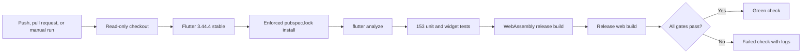

# Flutter continuous integration

CadPilot's Flutter client is validated automatically by `.github/workflows/flutter-ci.yml`. The workflow covers the portable application layer and produces a release-mode web compilation check without deploying or accessing production secrets.

## Trigger and trust boundary

Flutter CI runs for every push to `main`, every pull request targeting `main`, and manual workflow dispatch. It receives only read access to repository contents. It cannot deploy to Vercel, publish an Android package, modify GitHub content, or read application secrets.

Stale runs for the same branch or pull request are cancelled. A 25-minute job timeout bounds runner consumption if a tool or dependency download stalls.

## Pipeline



## Reproducible toolchain

The job pins Flutter **3.44.4 stable**, matching the SDK revision recorded in `tablet_app/.metadata` and used for local verification at this checkpoint. Repository checkout uses official `actions/checkout` v6.0.2 pinned to its immutable release commit. The Flutter setup action uses the `v2.23.0` release pinned to immutable commit `1a449444c387b1966244ae4d4f8c696479add0b2` rather than a mutable branch or tag.

`flutter pub get --enforce-lockfile` requires dependency resolution to agree with `tablet_app/pubspec.lock`. CI therefore detects missing or stale lockfile updates instead of silently creating a new dependency graph.

## Gates

| Gate | Command | Failure detected |
|---|---|---|
| Toolchain | `flutter --version` | Unexpected or unavailable SDK |
| Locked restore | `flutter pub get --enforce-lockfile` | Manifest/lockfile drift or unavailable dependencies |
| Static analysis | `flutter analyze --no-pub` | Dart type, lint, import, and analyzer findings |
| Tests | `flutter test --no-pub` | Unit, widget, persistence, CAD, auth, AI, or spatial-channel regressions |
| Wasm release | `flutter build web --wasm --release --no-pub` | Dependencies or code incompatible with Flutter WebAssembly release compilation |
| Web release | `flutter build web --release --no-pub` | Release compiler, asset, manifest, or web integration failures |

The WebAssembly release build does not replace the standard web release build. It provides concrete compiler compatibility evidence while Vercel continues to serve the conventional Flutter web output. The standard build runs last so `build/web` retains the deployable JavaScript output locally.

## Secret-free build

The release build uses no OpenAI key, JWT secret, database URL, signing material, or Vercel token. Server secrets must never be supplied through Flutter `--dart-define` values because web application constants are observable by clients.

A green workflow validates compilation and tests; it does not certify a production deployment, browser rendering, backend connectivity, native AR behavior, or store signing.

## Local equivalent

Run from `tablet_app/`:

```powershell
flutter pub get --enforce-lockfile
flutter analyze --no-pub
flutter test --no-pub
flutter build web --wasm --release --no-pub
flutter build web --release --no-pub
```

## Branch protection recommendation

Require the GitHub check named **Analyze, test, and build web** before merging into `main`, alongside the backend check. Repository settings should also require pull requests and prevent force pushes. Those owner-controlled settings are deliberately separate from this read-only workflow.

## Future platform gates

The next additions should remain separate jobs so failures are easy to isolate:

1. Android debug or unsigned release compilation on Ubuntu.
2. Native Android method-channel instrumentation tests with an emulator.
3. iOS compilation and native AR bridge tests on macOS.
4. Browser smoke tests against the compiled web artifact.
5. Signed release workflows guarded by GitHub environments and explicit approval.

Android and iOS builds are more expensive than portable analysis and web compilation, so they should use path filters or deliberate release triggers once introduced.
