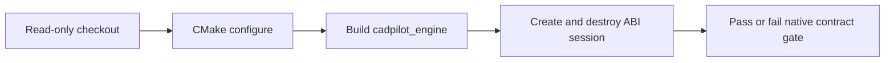

# Native CAD engine CI

The C++ ABI boundary under `cad_engine/ffi` is built and smoke-tested by
`.github/workflows/native-engine-ci.yml` on pushes, pull requests, and manual
dispatch. It configures CMake with testing enabled, builds the shared library,
and executes the ABI smoke executable through CTest.



Run the equivalent locally from the repository root:

```powershell
cmake -S cad_engine -B cad_engine/build -DBUILD_TESTING=ON
cmake --build cad_engine/build --config Release
ctest --test-dir cad_engine/build --build-config Release --output-on-failure
```

The smoke test verifies ABI versioning and session allocation/lifecycle. It does
not claim that native geometry operations are implemented; those remain behind
the documented CAD-engine migration boundary.
