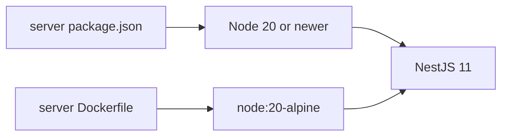
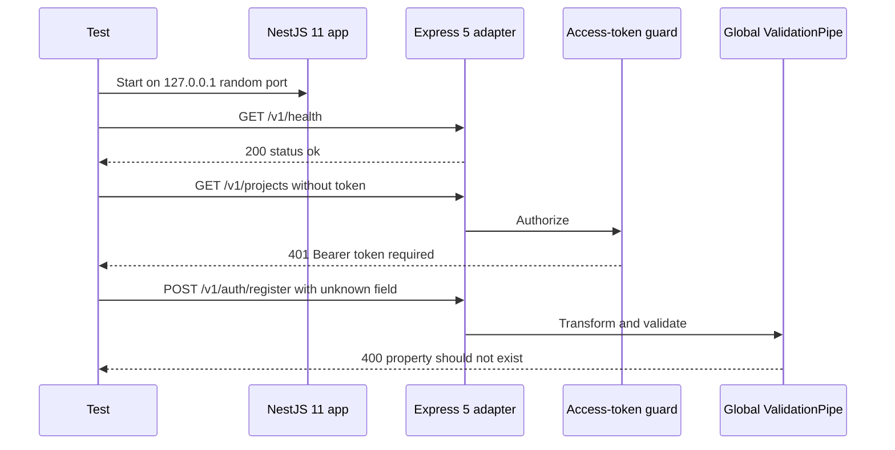
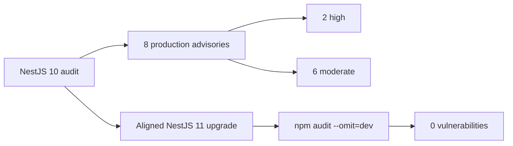

# NestJS 11 security migration

## Outcome

CadPilot's backend now runs on NestJS 11.1.28 with Express 5.2.1 and Multer 2.2.0. The migration removes the eight production advisories recorded in the preceding lint-gate checkpoint and produces a clean `npm audit --omit=dev` result without force flags, legacy peer resolution, or dependency overrides.

Official reference: [NestJS version 11 migration guide](https://docs.nestjs.com/migration-guide).

## Version alignment

| Package | Previous resolved version | Current resolved version |
|---|---:|---:|
| `@nestjs/common` | 10.4.22 | 11.1.28 |
| `@nestjs/core` | 10.4.22 | 11.1.28 |
| `@nestjs/platform-express` | 10.4.22 | 11.1.28 |
| `@nestjs/jwt` | 10.x | 11.0.2 |
| `@nestjs/testing` | 10.4.22 | 11.1.28 |
| `@nestjs/cli` | 10.x | 11.0.24 |
| Express | 4.x | 5.2.1 |
| Multer | Vulnerable pre-2.2 chain | 2.2.0 |

All Nest framework packages were changed atomically in `package.json` before dependency resolution. npm resolved a consistent tree without `--force` or `--legacy-peer-deps`.

## Runtime requirement

NestJS 11 requires Node.js 20 or newer. CadPilot enforces this in two places:



The development verification ran on Node 24.18.0. The production container remains based on Node 20 Alpine, satisfying the supported minimum.

## Express 5 compatibility review

The NestJS migration guide highlights path matching and query parsing changes in Express 5. CadPilot's route surface was reviewed before the upgrade:

- No anonymous wildcard routes such as `/*` exist.
- No optional route-string syntax using `?` exists.
- No regular-expression route strings exist.
- No custom `MiddlewareConsumer.forRoutes('*')` registrations exist.
- No endpoint depends on Express 4's extended nested-query parsing.
- API inputs are JSON request bodies, route parameters, and authorization headers.

CadPilot therefore keeps Express 5's default simple query parser instead of enabling legacy extended parsing unnecessarily.

## Real-HTTP regression suite

Unit tests cannot prove that the Express adapter, global prefix, pipes, and guards still compose correctly. This increment adds `nest11-http-compat.spec.ts`, which starts a real ephemeral HTTP listener with the production `AppModule` and only replaces the database provider.



### Database isolation

The compatibility suite imports the real `AppModule` but overrides `PrismaService` with an inert value. This keeps controllers, providers, the Express adapter, global prefix, validation pipe, and JWT guard real while avoiding a live database dependency for routes that must terminate before persistence.

The first test attempt revealed why this boundary matters: starting the production Prisma lifecycle requires a valid reachable database before the HTTP adapter can be exercised. The final test does not weaken production startup or change `PrismaService`.

## Security audit progression



The resolved tree no longer reports the earlier Nest core, Express/`qs`, Multer, body-parser, or `file-type` advisories.

No `npm audit fix --force` was used. This matters because a forced audit repair can silently select incompatible majors without proving application behavior.

## Verification

Run from `server/`:

```powershell
npm run lint
npm test
npm run build
npx prisma validate
npm audit --omit=dev
```

Verified results:

- TypeScript ESLint passes with zero findings.
- All 17 backend tests pass across four suites.
- Three real-HTTP NestJS 11/Express 5 compatibility tests pass.
- NestJS TypeScript build succeeds.
- Prisma schema validation succeeds.
- Production dependency audit reports 0 vulnerabilities.
- The complete Flutter checkpoint remains 139 passing tests.

## Dependency-install notices

npm reports install scripts for Prisma and Argon2 as requiring explicit allow-script review in this environment. CadPilot already depends on generated Prisma client code and native Argon2 bindings. The migration does not silently approve new scripts; production build operators should review and approve only the expected package scripts under their package-manager policy.

## Implementation map

| File | Responsibility |
|---|---|
| `server/package.json` | Aligned NestJS 11 constraints and Node 20 engine floor |
| `server/package-lock.json` | Reproducible Express 5 and remediated transitive graph |
| `server/Dockerfile` | Existing Node 20 runtime image |
| `server/src/nest11-http-compat.spec.ts` | Real adapter, prefix, guard, and validation regressions |
| `docs/backend-typescript-lint-gate.md` | Historical advisory baseline and resolution link |
| `README.md` | Updated backend test count and audit command |

## Rollback guidance

If deployment-specific behavior fails:

1. Do not partially downgrade individual Nest packages; keep framework majors aligned.
2. Preserve the lockfile from the last known-good commit.
3. Reproduce the failure with the real-HTTP compatibility suite.
4. Check Express 5 route syntax and query-parser assumptions first.
5. Treat a rollback to NestJS 10 as a temporary security exception because it reintroduces the recorded advisories.

## Remaining backend hardening

- Add hosted CI that enforces lint, tests, build, Prisma validation, and audit.
- Add request-body size limits and HTTP regression coverage for oversized payloads.
- Upgrade Prisma 5 through its separately documented major-version path.
- Review npm install-script allowlisting for deployment reproducibility.
- Add live PostgreSQL integration coverage in an isolated test database.