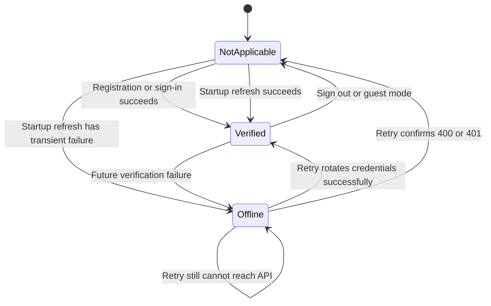
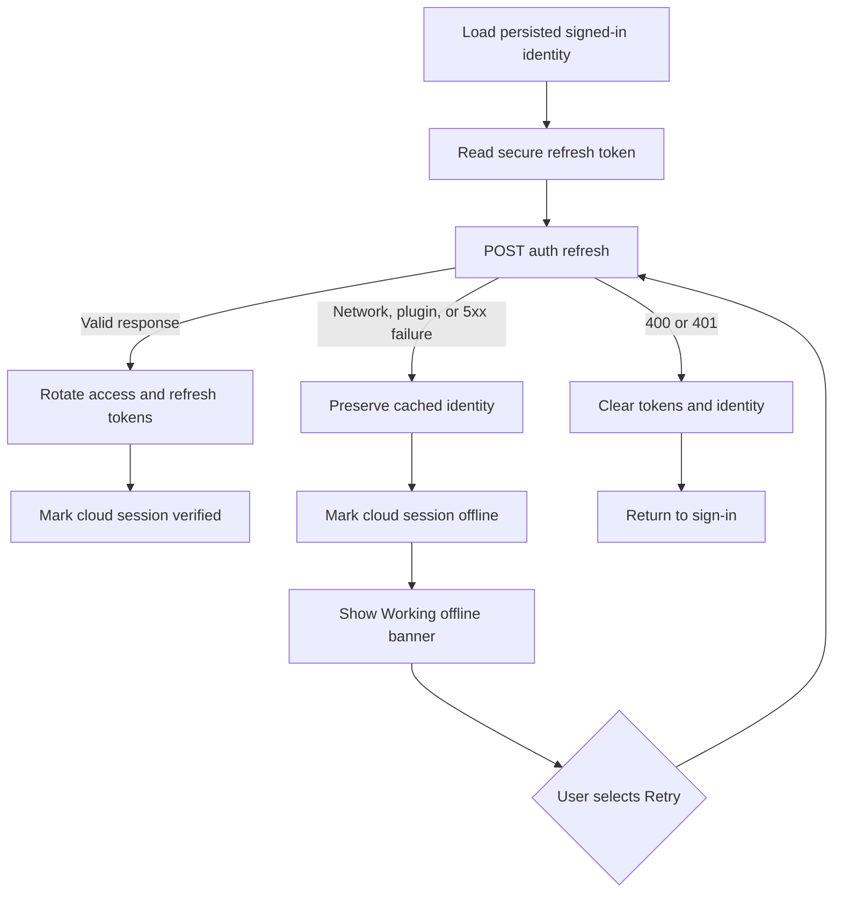

# Offline cloud-session verification increment

## Outcome

CadPilot now tells a signed-in user when startup credential rotation could not be verified because of a transient network, storage-plugin, or server failure. The app preserves local-first project access, displays a prominent **Working offline** banner, offers an explicit retry, and blocks cloud browsing, backup, import, and restore until verification succeeds.

This state is intentionally separate from the persisted `Session`. It is an in-memory observation about current cloud authority, not part of the user's saved identity.

## State model



| State | Meaning | Local projects | Cloud operations |
|---|---|---:|---:|
| `notApplicable` | Signed out or guest session | Available | Require sign-in |
| `verified` | Current startup/retry rotation succeeded | Available | Allowed with access token |
| `offline` | Cached signed-in identity retained after transient verification failure | Available | Blocked before network mutation |

## Startup and retry flow



## User experience

The dashboard banner states that local projects remain available and that the user must reconnect before backup or restore. The retry action calls the same validated refresh-and-rotation path used during startup; it does not merely hide the warning.

```mermaid
sequenceDiagram
    participant User
    participant Dashboard
    participant Session as Session controller
    participant API as Auth API
    participant Projects as Project controller

    Dashboard-->>User: Working offline; local projects remain available
    User->>Dashboard: Retry
    Dashboard->>Session: retryCloudVerification()
    Session->>API: Rotate refresh credentials
    API-->>Session: New credential pair
    Session-->>Dashboard: verified
    Dashboard-->>User: Remove offline banner
    User->>Projects: Back up project
    Projects->>Projects: Require verified status and access token
    Projects->>API: Authenticated sync
```

## Enforcement

Cloud status is checked before reading or sending a potentially stale access token:

- The cloud-project browser rejects loading while offline.
- Project backup rejects before invoking the sync endpoint.
- Cloud import rejects before downloading a project.
- Cloud restore rejects before replacing local state.
- Local create, open, edit, autosave, sketching, modeling, and spatial plans remain available.

The guard is defense in depth. The server remains authoritative and continues to validate access tokens and resource membership.

## Implementation map

| File | Responsibility |
|---|---|
| `tablet_app/lib/src/controllers.dart` | In-memory status provider, shared refresh flow, explicit retry, cloud-operation guard |
| `tablet_app/lib/src/app.dart` | Offline banner, retry action, cloud-browser guard |
| `tablet_app/test/cloud_session_status_test.dart` | Status, retry rotation, stale-token blocking, and widget behavior |
| `README.md` | Feature status, test count, and documentation index |

## Verification

From `tablet_app/`:

```powershell
dart format --output=none --set-exit-if-changed lib test
flutter analyze --no-pub
flutter test
flutter build web
flutter build apk --debug
```

This increment adds four tests. The complete Flutter suite contains 139 passing tests at this checkpoint.

## Deliberate limits

- Status is session-memory state and is recalculated on every launch.
- This is not a general network connectivity monitor; it describes cloud credential verification.
- Retry is user initiated and does not run an unbounded background loop.
- Native AR renderer availability remains `false` until a real platform view, camera texture, render loop, and anchor renderer ship.