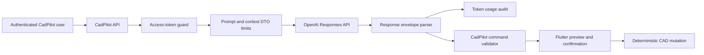
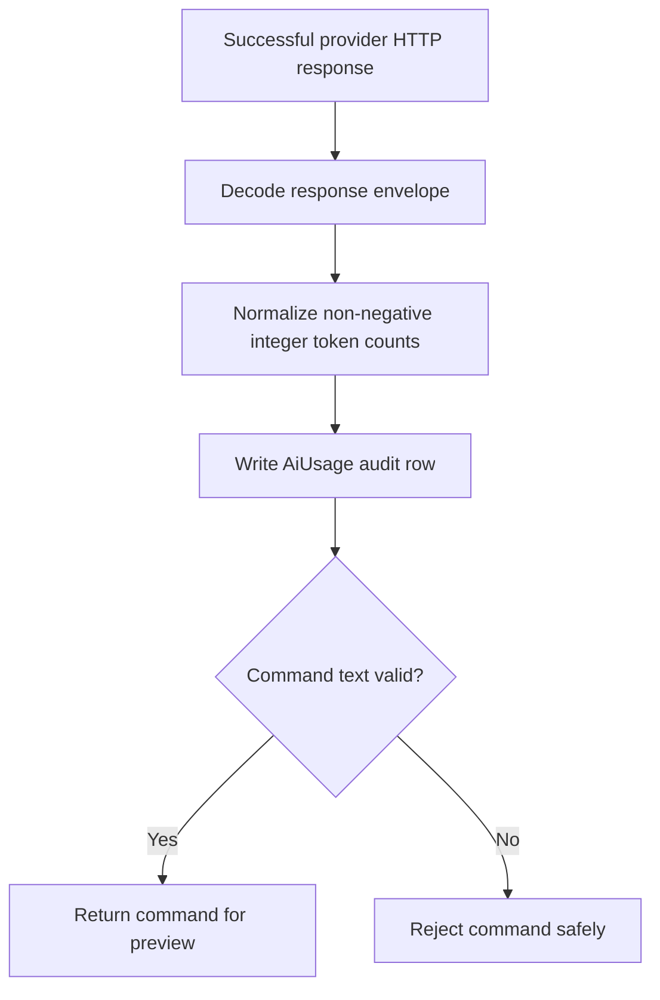

# OpenAI provider hardening increment

## Outcome

CadPilot's backend OpenAI integration is now a production-oriented foundation rather than an unbounded provider call. Authenticated CAD requests use the Responses API with strict structured output, `store: false`, a configurable bounded timeout, server-side schema validation, safe public errors, and token-usage auditing.

The model remains configurable through `OPENAI_CAD_MODEL` and defaults to `gpt-5.6-luna`. The official model catalog identifies GPT-5.6 Luna as a cost-sensitive GPT-5.6 model available through the Responses API with structured output support.

Official references:

- [OpenAI model catalog](https://developers.openai.com/api/docs/models)
- [OpenAI developer resources and structured-output guide](https://developers.openai.com/resources)

## Trust boundary



No OpenAI credential enters the Flutter application. `OPENAI_API_KEY` is read only by the NestJS server and is omitted from response bodies, logs, command documents, and client build definitions.

## Provider request

```mermaid
sequenceDiagram
    participant Flutter
    participant API as CadPilot API
    participant OpenAI as Responses API
    participant DB as PostgreSQL

    Flutter->>API: POST /v1/ai/commands with access token
    API->>API: Validate prompt length and context object
    API->>OpenAI: model + instructions + input + strict JSON schema
    Note over API,OpenAI: store=false; bounded AbortSignal timeout
    OpenAI-->>API: response envelope + usage
    API->>DB: Record provider, model, response ID, token counts
    API->>API: Parse and validate command again
    API-->>Flutter: Safe command + normalized usage
    Flutter->>Flutter: Preview; require explicit confirmation
```

## Timeout policy

`OPENAI_TIMEOUT_MS` accepts an integer from 1,000 through 120,000 milliseconds.

| Configuration | Effective timeout |
|---|---:|
| Missing or blank | 30,000 ms |
| Valid bounded integer | Configured value |
| Less than 1,000 ms | 30,000 ms |
| Greater than 120,000 ms | 30,000 ms |
| Non-numeric or fractional | 30,000 ms |

The service passes an `AbortSignal` to `fetch`. Network failures, aborts, provider errors, and non-success HTTP statuses map to the same safe service-unavailable response. Socket details, upstream bodies, API keys, and provider diagnostics are not exposed to the client.

## Defense-in-depth validation

The request asks OpenAI for strict JSON Schema output, but provider output is still treated as untrusted. CadPilot independently verifies:

- The response body is a JSON object.
- An `output_text` item exists and contains non-empty text.
- The text parses as JSON.
- `schemaVersion` is exactly `1`.
- `commandId` is non-empty.
- Intent and target type use supported values.
- Target IDs are non-empty strings when present.
- There are between one and twelve operations.
- Every operation has an ID, supported type, and parameter object.
- Assumptions are strings and contain no more than twelve entries.
- `requiresConfirmation` is exactly `true`.

The Flutter command validator and deterministic model engine remain additional downstream gates. Provider output never mutates geometry directly.

## Metering order



Usage is recorded before command-text acceptance because the provider request may incur cost even when its returned structured content is malformed. Invalid or missing usage values normalize to zero rather than entering negative, fractional, or unsafe integers into billing data.

## Environment configuration

Copy `server/.env.example` to a local secret file and replace all placeholders:

```dotenv
OPENAI_API_KEY=
OPENAI_CAD_MODEL=gpt-5.6-luna
OPENAI_TIMEOUT_MS=30000
```

- Never commit a populated API key.
- Keep the key out of Flutter `--dart-define` values and Vercel client variables.
- Use separate JWT access and refresh secrets.
- Configure the API key in the server deployment environment only.

## Failure behavior

| Failure | Public behavior | Usage row |
|---|---|---:|
| API key not configured | AI commands not configured | No |
| Network error or timeout | Temporarily unavailable | No |
| Provider non-2xx | Temporarily unavailable | No |
| Response body is not JSON | Invalid provider response | No reliable usage available |
| Valid envelope without output text | No structured command | Yes |
| Malformed command JSON | Invalid structured command | Yes |
| Structurally incomplete command | Invalid structured command | Yes |
| Valid command | Return command and usage | Yes |

## Implementation map

| File | Responsibility |
|---|---|
| `server/src/ai.service.ts` | Provider request, timeout, decoding, validation, metering, safe errors |
| `server/src/ai.service.spec.ts` | Missing config, success, network/provider errors, timeout, malformed and incomplete output |
| `server/src/ai.controller.ts` | Authentication and DTO limits |
| `server/.env.example` | Secret-free deployment variable template |
| `server/prisma/schema.prisma` | Durable per-user AI usage rows |
| `tablet_app/lib/src/ai_commands.dart` | Client validation, preview, confirmation, deterministic apply |

## Verification

Run from `server/`:

```powershell
npm test
npm run build
```

Verified results at this checkpoint:

- All 14 backend tests pass across AI, projects, and health suites.
- Seven focused AI provider tests pass.
- NestJS TypeScript build succeeds.
- The complete Flutter suite remains at 139 passing tests from the preceding client checkpoint.

The `npm run lint` gate is now active through the follow-up [backend TypeScript lint increment](backend-typescript-lint-gate.md).

## Remaining production work

- Create model-quality evaluations against representative CAD prompts and adversarial contexts.
- Add per-user and per-plan request/token quotas before billing launch.
- Add cost dashboards and budget alerts using `AiUsage` records.
- Define retry policy for rate limits without duplicating billable requests.
- Add moderation/policy rules appropriate to uploaded project context.
- Add an operational circuit breaker and provider health metrics.
- Delivered locally in `backend-typescript-lint-gate.md`; add the verified lint command to hosted CI when CI configuration is introduced.