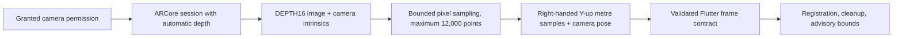

# Phase 6B: Android ARCore depth adapter

CadPilot now has an Android implementation of its bounded depth-frame contract.
After the user grants camera access, an ARCore-capable Android tablet can report
whether its configured ARCore session supports `AUTOMATIC` depth. A capture request
creates or reuses that session, obtains one `DEPTH16` image, samples a bounded number
of calibrated depth pixels, and returns a normalized point-cloud frame to the existing
Flutter scan pipeline.

## Guarantees

- The adapter only advertises native depth capture after camera permission and
  ARCore depth-mode support are both present.
- It returns `depth_camera`, not LiDAR. Android camera depth is never labeled
  as LiDAR scanning.
- One frame is capped at 12,000 samples even if Flutter requests a larger
  contract limit. This avoids moving dense scan data through a method channel.
- Points use metres and the existing `right_handed_y_up_meters` coordinate
  system. The camera pose accompanies local camera-space samples for the
  registration layer.
- Missing depth data and ARCore failures return an explicit unavailable error;
  no empty frame is treated as a completed scan.

## Verification boundary

The Android debug build verifies that the ARCore API integration compiles. A
physical ARCore Depth-capable tablet remains required to validate calibration,
camera lifecycle behavior, and measurement error. The resulting Flutter
measurements remain advisory scan bounds, not certified or manufacturing-grade
dimensions.

The spatial workspace exposes **Capture advisory depth scan** only when this
capability is ready. It requests three bounded frames, then displays the
existing cleaned scan bounds and provenance. No scan is persisted as a CAD mesh
or presented as a certified real-world measurement.

Completed scans persist a compact advisory record with bounded dimensions,
point/frame counts, confidence, resolution, capture time, and session ID. Raw
depth images and point clouds are deliberately not stored in the project JSON;
they require a dedicated encrypted spatial-data store and user-controlled
retention policy before shipping.

Cloud sync applies the same rule server-side: up to 500 validated scan-summary
records are accepted inside the existing project manifest, while raw points,
point clouds, depth images, oversized manifests, and malformed numeric metadata
are rejected before reaching project or revision storage.
