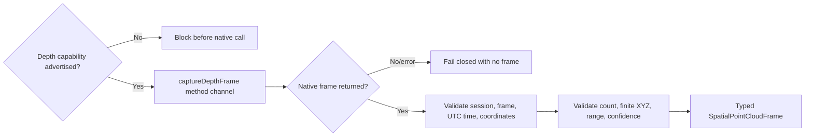
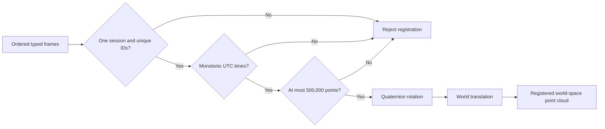
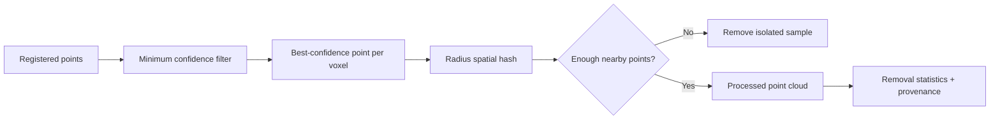
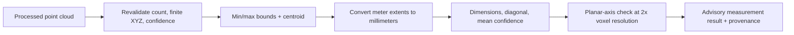
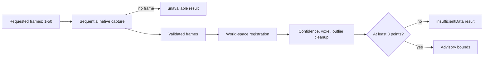

# Phase 6B: Native depth and point-cloud frame contract

This increment establishes CadPilot's validated boundary for receiving a single depth-derived point-cloud frame from a future iOS LiDAR or Android depth-camera host. It does **not** claim that native depth capture, reconstruction, meshing, or LiDAR hardware support is complete.

## Why this boundary comes first

Native spatial APIs return platform-specific buffers, coordinate conventions, confidence values, timestamps, and tracking metadata. Passing those values directly into CAD would make corrupt, oversized, mismatched, or non-finite sensor data part of the project model. CadPilot now normalizes and validates one bounded frame before any reconstruction pipeline is allowed to consume it.

## Contract

A capture request contains:

- the trimmed active capture `sessionId`;
- coordinate system `right_handed_y_up_meters`;
- maximum requested point count of 250,000.

A native response must contain:

- a non-empty matching `sessionId`;
- a non-empty `frameId`;
- an ISO-8601 UTC `capturedAt` timestamp;
- the exact right-handed, Y-up, meter coordinate-system identifier;
- a sensor-to-world pose containing bounded translation and a normalized quaternion;
- between 3 and 250,000 point samples;
- finite numeric X, Y, and Z values within a conservative ±1,000 meter bound;
- a finite confidence value from 0 through 1 for every sample.

The strict coordinate-system name prevents millimeter/meter and handedness mistakes from silently distorting a CAD model. Native hosts must transform their platform coordinates into this convention before returning data.

## Pose normalization and multi-frame registration

Every frame now includes a sensor-to-world pose in the same right-handed, Y-up, meter system. Translation components must be finite and remain within ±1,000 meters. Rotation uses an `(x, y, z, w)` quaternion whose squared magnitude must stay within 0.01 of one; rejecting non-unit quaternions prevents scale distortion during rotation.

`SpatialFrameRegistration` accepts time-ordered frames from one session, rejects duplicate frame IDs, caps the aggregate at 500,000 samples, rotates each sensor-space point, applies world translation, and preserves confidence values.

Registration is deterministic and intentionally performs only coordinate transformation. Cleanup is a separate, explicitly configured stage; meshing and persistence still require their own accuracy tolerances and tests.

## Deterministic point-cloud cleanup

`SpatialPointCloudProcessor` separates cleanup policy from registration and returns a typed result plus stage-by-stage statistics.

Processing settings are validated before point work:

- confidence threshold must be from 0 through 1;
- voxel size must be from 1 millimeter through 1 meter;
- isolation radius must be between one and four voxel widths;
- required neighbor count must be from 0 through 26.

The radius-to-voxel ratio prevents an unbounded number of downsampled candidates from accumulating in each spatial-hash neighborhood. Voxel keys use mathematical floor operations, so negative and positive coordinates remain in distinct deterministic cells. The highest-confidence sample wins a voxel; equal-confidence ties preserve input order. A zero-neighbor setting intentionally disables isolation filtering.

This stage does not invent geometry or average surfaces. Default thresholds need calibration against labeled physical-device data before they can be treated as measurement-grade.

## Advisory measurement extraction

`SpatialMeasurementExtractor` derives bounded, axis-aligned observations from a processed cloud without claiming surface reconstruction.

The result includes width on X, height on Y, depth on Z, diagonal length, centroid, mean confidence, point count, source frame IDs, session ID, processing resolution, and the thinnest planar axis when its extent is no more than twice the voxel size. Extraction requires at least three points, rejects point-like and line-like bounds, revalidates finite coordinates and confidence, and retains the 500,000-point safety ceiling.

These are **axis-aligned scan bounds**, not oriented dimensions, watertight volume, surface area, toleranced inspection data, or certified measurements. The API always carries the label `Advisory scan bounds; not a certified measurement.` Physical-device calibration and an oriented/segmented geometry model are required before dimensions can drive manufacturing decisions.

## Bounded scan pipeline

`SpatialScanPipeline` is the orchestration boundary between native frame acquisition and
advisory scan output. It captures sequentially, with an explicit upper bound of 50
frames per scan, and then performs registration, cleanup, and measurement extraction in
that order. It never invents a measurement: no native frame returns `unavailable`, and
a scan with fewer than three validated processed points returns `insufficientData`.

This is a Dart orchestration and safety boundary, not a claim that capture is
device-verified. Android and iOS hosts implement bounded native acquisition,
but both require compatible physical-hardware calibration and lifecycle testing.
## Capability gate

Capture is callable only when the capability snapshot reports depth hardware support, identifies the method as `lidar` or `depth_camera`, and explicitly reports `nativeDepthCaptureAvailable`. Web and missing plugins return no frame. Platform errors also return no frame. Malformed frames throw `FormatException` so programming/data-contract errors remain distinguishable from unavailable hardware.

Android reports `depth_camera` only after camera access and ARCore automatic-depth
support; iOS reports `lidar` only after camera access and ARKit scene-depth plus
scene-reconstruction support. Both hosts return explicit unavailability errors
when a frame cannot be acquired. The adapters are bounded capture paths, not
camera renderers, reconstruction engines, or calibrated measurement systems.

## Safety properties

- Unsupported devices are rejected before invoking native code.
- Empty session identities are rejected.
- A response for another session is never accepted.
- NaN and infinite coordinates are rejected.
- Impossible confidence values and extreme coordinates are rejected.
- Tiny and oversized frames are rejected.
- Platform unavailability never becomes a successful empty scan.
- No point cloud is persisted or converted into CAD geometry in this increment.

## Verification

- Nineteen focused depth-frame, registration, cleanup, and measurement tests pass.
- The complete Flutter suite contains 158 passing tests.
- Flutter analysis passes with no issues.
- Android debug compilation verifies the Kotlin method-channel boundary against ARCore 1.54.0.
- Standard and WebAssembly web release builds remain compatible because web capture fails closed.

## Next Phase 6B work

1. Validate Android and iPad session lifecycle, pose convention, and intrinsics
   alignment on compatible physical hardware.
2. Add pose-quality and tracking-state metadata from native capture.
3. Calibrate cleanup defaults against labeled physical-device scans.
4. Build bounded surface reconstruction without treating scan bounds as a mesh.
5. Add encrypted raw-spatial-data retention only after consent and deletion flows.

Each step must retain separate capability claims. Depth frames, registered point clouds, meshes, and editable CAD geometry are different completion levels.
