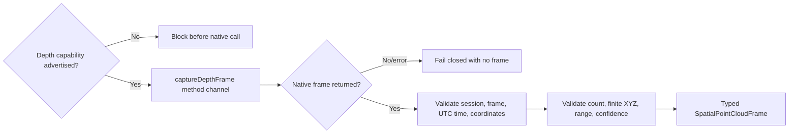

# Phase 6B: Native depth and point-cloud frame contract

This increment establishes CadPilot's validated boundary for receiving a single depth-derived point-cloud frame from a future iOS LiDAR or Android depth-camera host. It does **not** claim that native depth capture, reconstruction, meshing, or LiDAR hardware support is complete.

## Why this boundary comes first

Native spatial APIs return platform-specific buffers, coordinate conventions, confidence values, timestamps, and tracking metadata. Passing those values directly into CAD would make corrupt, oversized, mismatched, or non-finite sensor data part of the project model. CadPilot now normalizes and validates one bounded frame before any reconstruction pipeline is allowed to consume it.

## Contract

A capture request contains:

- the trimmed active capture `sessionId`;
- coordinate system `right_handed_y_up_meters`;
- maximum requested point count of 250,000.

A native response must contain:

- a non-empty matching `sessionId`;
- a non-empty `frameId`;
- an ISO-8601 UTC `capturedAt` timestamp;
- the exact right-handed, Y-up, meter coordinate-system identifier;
- between 3 and 250,000 point samples;
- finite numeric X, Y, and Z values within a conservative ±1,000 meter bound;
- a finite confidence value from 0 through 1 for every sample.

The strict coordinate-system name prevents millimeter/meter and handedness mistakes from silently distorting a CAD model. Native hosts must transform their platform coordinates into this convention before returning data.

## Capability gate

Capture is callable only when the capability snapshot reports `sceneDepthSupported` and identifies the method as `lidar` or `depth_camera`. Web and missing plugins return no frame. Platform errors also return no frame. Malformed frames throw `FormatException` so programming/data-contract errors remain distinguishable from unavailable hardware.

Android currently reports `sceneDepthSupported: false` and handles `captureDepthFrame` with the explicit `depth_capture_unavailable` platform error. This preserves truthful product behavior until an ARCore Depth session, camera texture, render/update loop, and depth-image conversion are implemented and verified on physical hardware.

## Safety properties

- Unsupported devices are rejected before invoking native code.
- Empty session identities are rejected.
- A response for another session is never accepted.
- NaN and infinite coordinates are rejected.
- Impossible confidence values and extreme coordinates are rejected.
- Tiny and oversized frames are rejected.
- Platform unavailability never becomes a successful empty scan.
- No point cloud is persisted or converted into CAD geometry in this increment.

## Verification

- Five focused point-cloud contract tests pass.
- The complete Flutter suite contains 144 passing tests.
- Flutter analysis passes with no issues.
- Android debug compilation verifies the Kotlin method-channel boundary against ARCore 1.54.0.
- Standard and WebAssembly web release builds remain compatible because web capture fails closed.

## Next Phase 6B work

1. Add a native ARCore Depth capability probe tied to a configured ARCore session.
2. Implement physical-device depth image acquisition and coordinate conversion.
3. Add multi-frame registration with pose metadata.
4. Filter low-confidence and statistical outlier points.
5. Downsample deterministically before project persistence.
6. Build bounded surface reconstruction and measurement extraction.
7. Add an iOS ARKit/LiDAR adapter using the same normalized frame contract.

Each step must retain separate capability claims. Depth frames, registered point clouds, meshes, and editable CAD geometry are different completion levels.
