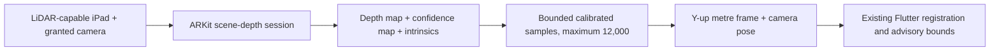

# Phase 6B: iPad ARKit depth adapter

CadPilot's iOS host now implements the same bounded frame handoff used by the
Android ARCore adapter. On an iPad that reports ARKit scene-depth support and
after the user grants camera access, a depth request starts an `ARSession` with
the `.sceneDepth` frame semantic and waits up to two seconds for a usable frame.

The adapter only advertises native LiDAR capture after ARKit reports both scene
depth and scene reconstruction support and camera access is granted. It does
not enable a renderer, mesh reconstruction, certified measurement, or raw
point-cloud persistence. A missing depth frame times out as unavailable rather
than manufacturing an empty result.

## Verification boundary

Windows cannot compile or run the Swift host. The repository macOS CI iOS build
is the first compilation gate. A LiDAR-capable iPad must then validate session
lifecycle, pixel/intrinsics alignment, pose convention, confidence thresholds,
and measurement error before this can be claimed as device-verified.
