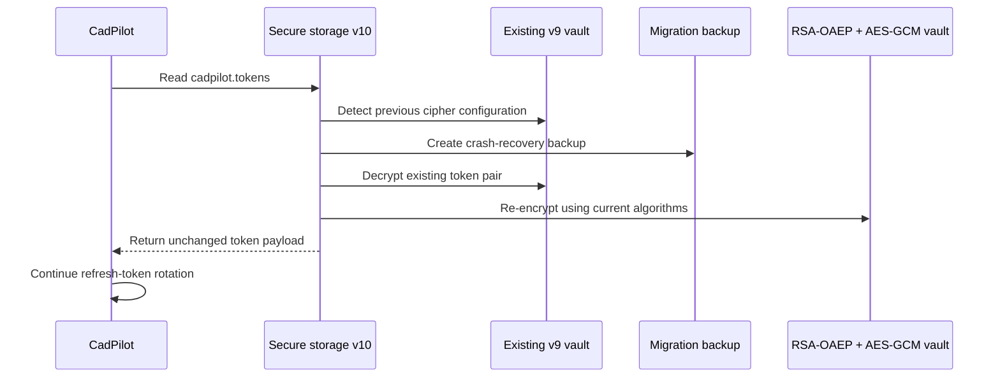
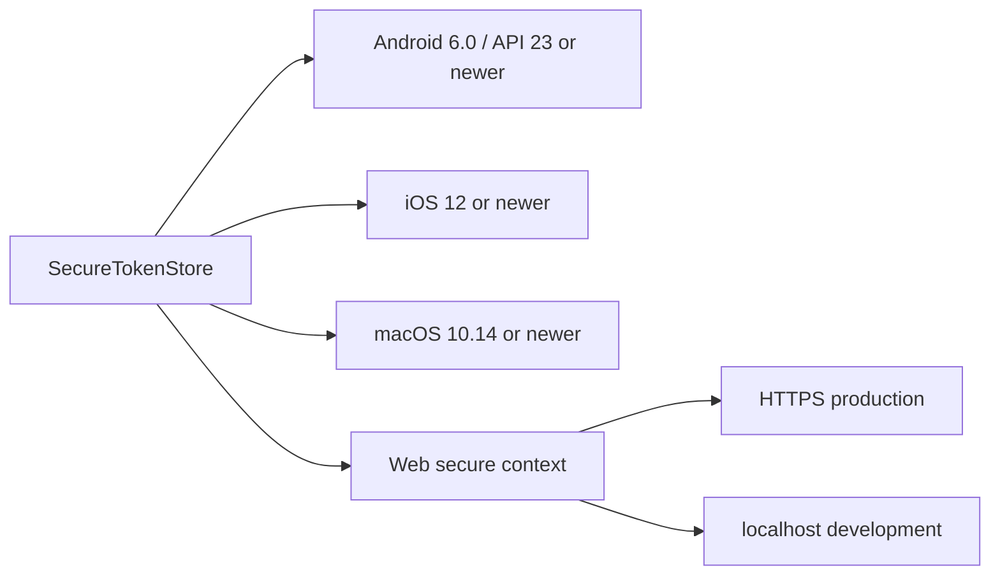
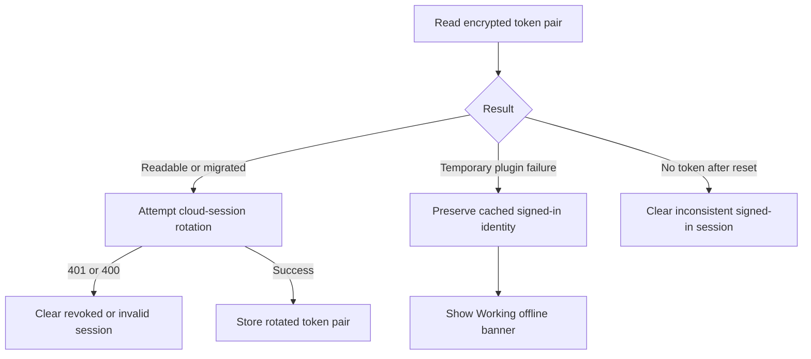

# Secure storage v10 migration

## Outcome

CadPilot now uses `flutter_secure_storage` 10.3.1 across Android, Apple platforms, web, Windows, and Linux. The Android token vault migrates away from the deprecated encrypted-shared-preferences path to the plugin's current RSA-OAEP key wrapping and AES-GCM storage cipher. Automatic algorithm migration and crash-resistant migration backup are explicitly enabled.

The upgrade also replaces the legacy web implementation based on `dart:html` and `dart:js_util`. Flutter's web build now completes its WebAssembly compatibility dry run successfully.

Official references:

- [flutter_secure_storage changelog](https://pub.dev/packages/flutter_secure_storage/changelog)
- [flutter_secure_storage package guidance](https://pub.dev/packages/flutter_secure_storage)

## Dependency changes

| Component | Previous | Current |
|---|---:|---:|
| `flutter_secure_storage` | 9.2.4 resolved | 10.3.1 resolved |
| Android cipher path | Deprecated encrypted shared preferences | RSA-OAEP key cipher and AES-GCM storage cipher |
| Web implementation | `dart:html` / legacy JS interop | `package:web` / modern JS interop |
| Darwin implementation | Separate legacy macOS package | Unified Darwin implementation |
| Windows implementation | 3.1.2 | 4.2.2 |
| Linux implementation | 1.2.3 | 3.0.1 |
| Icon assets | Material font only resolved | Material and Cupertino fonts resolved and tree-shaken |

## Android migration sequence



The stored logical format remains one access token and one refresh token separated by a newline. Only the platform encryption implementation changes, so the session controller and API contract remain stable.

## Configuration

`SecureTokenStore` uses:

```dart
AndroidOptions(
  migrateOnAlgorithmChange: true,
  migrateWithBackup: true,
)
```

- `migrateOnAlgorithmChange` preserves existing v9 credentials while adopting the new defaults.
- `migrateWithBackup` creates recovery material before mutation so an interrupted migration is less likely to destroy the only readable token copy.
- The application never reads, writes, or logs the migration backup directly.

## Platform requirements



The current Flutter/Android build configuration satisfies the plugin's Android minimum. Apple builds must retain compatible deployment targets. Web secure storage must run on HTTPS in production; the deployed Vercel origin provides HTTPS.

## Web and icon pipeline

The upgrade removes the previous Wasm dry-run incompatibilities from `flutter_secure_storage_web`. Adding the standard `cupertino_icons` dependency supplies the font family requested by Flutter's icon tree shaker. Both Material and Cupertino fonts are reduced to only the glyphs used by the compiled application.

This does not switch the production deployment to Wasm. It establishes compatibility evidence while the existing JavaScript web build remains the release artifact.

## Failure behavior



The offline-session behavior added in the prior increment remains the recovery boundary for transient storage/plugin failures. Confirmed invalid authentication still fails closed.

## Verification

Completed on Windows with Flutter 3.44.4 and Dart 3.12.2:

```powershell
flutter pub get
flutter analyze --no-pub
flutter test
flutter build web
flutter build apk --debug --no-pub
```

Results:

- Dependency graph resolves `flutter_secure_storage` 10.3.1.
- Static analysis reports no issues.
- All 139 Flutter tests pass.
- Web release build succeeds.
- WebAssembly compatibility dry run succeeds.
- Cupertino and Material icon assets resolve and tree-shake successfully.
- Android debug APK builds successfully with the upgraded native plugin.

## Rollout guidance

- Test an upgrade over an installed v9 build on at least one physical Android device before store release.
- Verify the user remains signed in and that the first token refresh rotates credentials successfully.
- Do not disable algorithm migration until the supported upgrade window no longer includes v9 installations.
- Do not serve the production web app over plain HTTP.
- Keep release-signing credentials outside the repository.

## Deliberate non-change

Android `applicationId` and Apple bundle identifiers still use Flutter placeholder values. Those identifiers become long-lived store identities and must be chosen by the product owner before publishing; this increment does not guess them from the GitHub username.