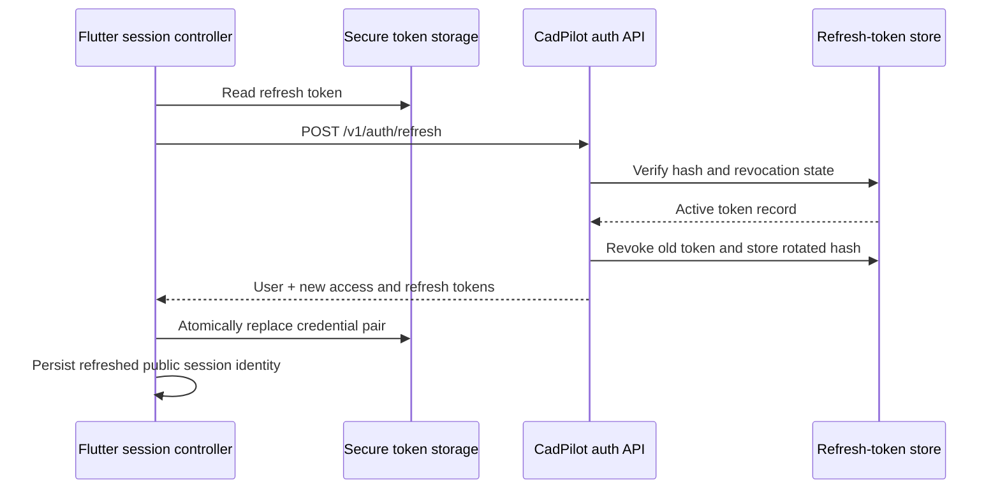
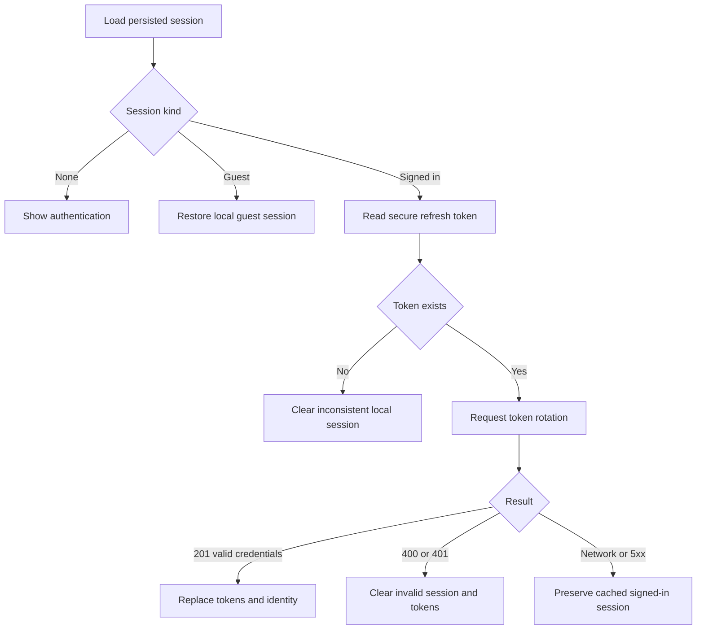
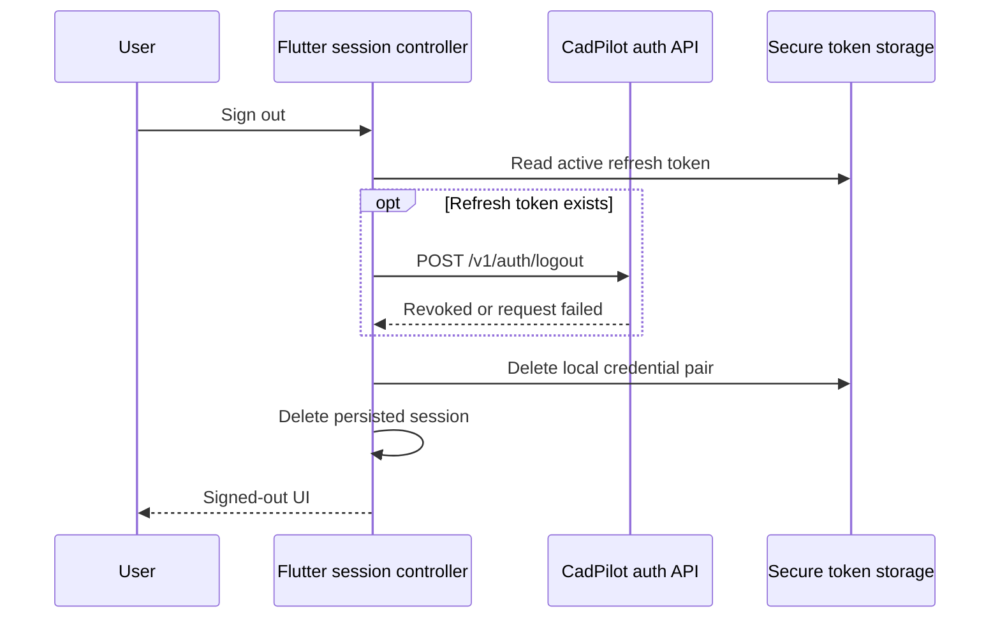

# Session refresh and revocation increment

## Outcome

The Flutter client now completes the authentication lifecycle already supported by the CadPilot API. A previously signed-in user presents the securely stored refresh token when the app starts, accepts a rotated credential pair only after a valid server response, and revokes the active refresh token during sign-out. Guest sessions remain entirely local.

## Trust boundary



The access and refresh tokens stay in `flutter_secure_storage`. Shared preferences contain only the non-secret `Session` projection used by the UI. Tokens are never copied into project manifests, application logs, analytics, or user-facing errors.

## Startup decision model



This distinction prevents two undesirable outcomes:

- A revoked or malformed refresh token cannot silently keep an authenticated cloud session alive.
- A temporary network or server outage does not erase the user's local session or local-first project access.

Preserving the cached session during an outage does not grant fresh server authority. Cloud operations still require a valid access token and remain subject to API authorization.

## Logout behavior



Server revocation is best effort because local sign-out must remain available offline. The controller uses `finally` semantics: secure tokens and the persisted session are cleared whether revocation succeeds, the API returns an error, or the device has no network connection.

## Failure handling

| Condition | Client action | Rationale |
|---|---|---|
| No saved session | Remain signed out | No identity to restore |
| Guest session | Restore locally without auth traffic | Guest mode is device-local |
| Signed-in session without refresh token | Clear inconsistent session | Prevent misleading authenticated state |
| Refresh succeeds | Store rotated pair and refreshed identity | Retire replayable old refresh token |
| Refresh returns 400/401 | Clear tokens and session | Server confirmed credentials are invalid |
| Refresh fails from connectivity or 5xx | Preserve cached session | Maintain local-first continuity |
| Logout API succeeds | Clear all local auth state | Complete server and device logout |
| Logout API fails | Still clear all local auth state | User must always be able to sign out locally |

## Implementation map

| File | Responsibility |
|---|---|
| `tablet_app/lib/src/token_store.dart` | Read access and refresh tokens from encrypted storage and clear them together |
| `tablet_app/lib/src/cloud_api.dart` | Call `/auth/refresh` and `/auth/logout`, validate credentials, preserve safe status codes |
| `tablet_app/lib/src/controllers.dart` | Orchestrate startup rotation, outage recovery, invalidation, and sign-out cleanup |
| `tablet_app/test/cloud_api_test.dart` | Verify endpoint method, path, request payload, parsing, and unauthorized status |
| `tablet_app/test/session_controller_test.dart` | Verify lifecycle decisions through provider-controlled integration tests |

## Verification

Run from `tablet_app/`:

```powershell
dart format --output=none --set-exit-if-changed lib test
flutter analyze --no-pub
flutter test
flutter build web
flutter build apk --debug
```

The increment adds seven tests: three HTTP contract tests and four session-controller lifecycle tests. At this increment, the complete Flutter suite contains 135 passing tests.

## Remaining production hardening

- Delivered in `offline-cloud-session-verification-increment.md`: explicit retry banner and cloud-operation guards for cached offline sessions.
- Add refresh request coalescing if multiple API requests can independently trigger rotation.
- Support server-managed device/session lists and per-device revocation.
- Add refresh-token reuse detection and security audit events on the backend.
- Exercise rotation and revocation against a deployed staging API with real secure storage.